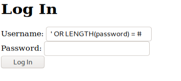
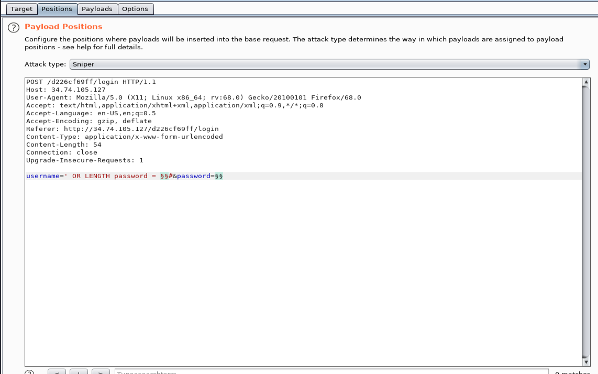

# Hacker101
Solution to some hacker101 CTF 

## Micro-CMS V2 

**- Flag 3:**

To do that I did an Intruder bruteforce attack using BurpSuite.

First of all, I tried to get the password length, using the next SQL query.

I captured this query with BurpSuite and sent to intruder (left clicking on the intercept), configuring it like the next image while using this payload : [1,..,15]. 

It turned out that the password length was 7, it was guessed thanks to the length of the response in the intruder attack, because for password length 7, the response length was different.

After that I just did another similar attack, but this time using username=' OR password LIKE "_______"#, where each underscore was a possible character. For this attack I used the bruteforce payload provided by BurpSuite. When the attack finished, I logged in using: 

    -Username = ' OR 1=1#
    -Password = (The one found by the attack) <- In my case was Malcolm
    
## Cody's First Blog: 

**- Flag 1:**

To get this flag, it was just necessary to inject a php script in the write comment section. For example:

    <?php echo "TEST"; ?>
    
## PetshopPro

**- Flag 1:**

Add something to the shopping cart. In the checkout page, inspect element and a hidden input can be observed there, change the input to be visible and after that change the input and make some item free.

